# latency-measurer

This solution allows you to easily collect, measure and analyze latency metrics from any server supported by AWS Systems Manager Agent (either on AWS, your own Datacenter or other providers) to AWS EC2 endpoints (default) or to your own IP endpoints as long as there is network connectivity.

After registering your compute with AWS Systems Manager, you'll be able to run/schedule an automation document that will perform the latency testing against the endpoints, save the results to S3 , and facilitate dashboard visualization of the results in Quicksight, 2 default visuals are provided but you can extend them and create your own visuals.

# Solution Architecture

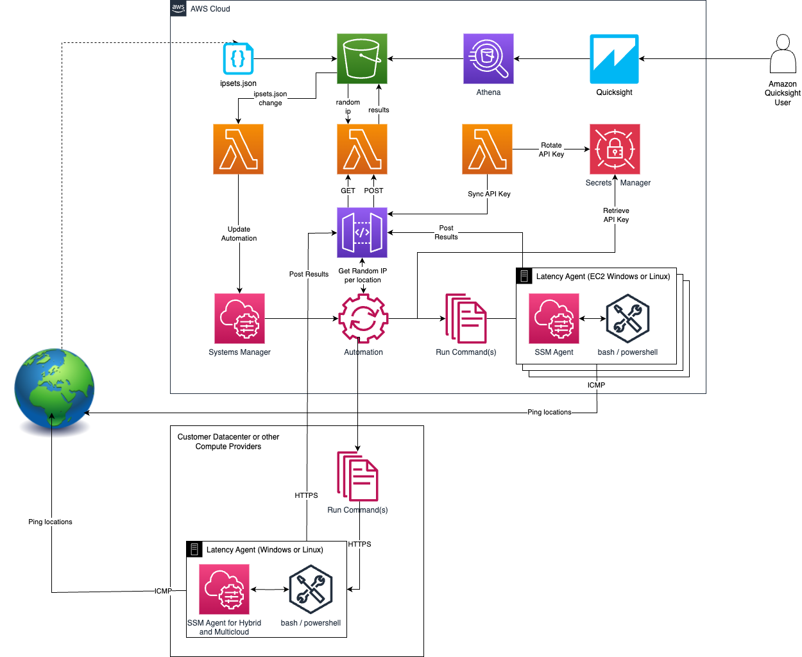

## Getting started

This solution uses [SAM cli](https://docs.aws.amazon.com/serverless-application-model/latest/developerguide/install-sam-cli.html) as the packaging and deployment tool. Ensure you have this installed locally.

You will need either Python 3.12 installed locally as well or Docker Desktop installed locally to build this solution.

## Pre-Deployment

Ensure your AWS account is signed up for Amazon Quicksight , you can sign up for Standard Edition or Enterprise Edition following the steps in https://docs.aws.amazon.com/quicksight/latest/user/signing-up.html

## Deployment

First clone this repository locally:

```bash
git clone https://github.com/aws-samples/latency-measurer.git
cd latency-measurer
```

If using Docker Desktop (recommended) the command to build the solution is this. (If using Python locally and not using Docker then omit the `-u` from this command):

```bash
sam build -u
```

To deploy the solution, issue the following command and follow the on screen promptsL

```bash
sam deploy --guided
```

## Usage

The first required step is to create an `ipsets.json` file and upload it to the S3 bucket created for you. If you intend to do testing against the Endpoints listed in the [AWS EC2 Reachability Page](https://ec2-reachability.amazonaws.com/) this file can be created automatically by running the **Scraper** Lambda function:

```bash
sam remote invoke ScraperFunction
```

If you intend to do latency testing against your own endpoints follow the format of the sample provided in /samples/ipset.json

The creation of this file and placing it in the S3 bucket (which is done automatically by the Scraper function), triggers a second Lambda. This Lambda creates an SSM Automation document called **latency-checker**, executing this document will run the ping tests and collect the data.

## Post-Deploy

# Running the automation document on your compute instances

This solution depends on having the AWS Systems Manager Agent installed on your compute instance, either on AWS EC2 or on your own datacenter or alternative compute provider.
For hybrid and multicloud setup follow the instructions available at https://docs.aws.amazon.com/systems-manager/latest/userguide/systems-manager-managedinstances.html

You can either run the automation document manually on your selected instances on demand from the AWS Systems Manager console or using the AWS CLI.

This example shows running the automation document on 2 instances with EC2 Systems Manager agent homed in the eu-west-1 region and selecting to ping the AWS locations of Europe and Africa:

```bash
aws ssm start-automation-execution --document-name "latency-checker" --document-version "\$DEFAULT" --parameters '{"InstanceIds":["i-07cf7250c766cdba6","i-07af0a6d41a9abb4a"],"UsEast":["Exclude"],"UsWest":["Exclude"],"Canada":["Exclude"],"SouthAmerica":["Exclude"],"Europe":["Include"],"Africa":["Include"],"MiddleEast":["Exclude"],"AsiaPacific":["Exclude"],"China":["Exclude"]}' --region eu-west-1
```

If you want to perform automated latency testing for an extended period of time, the recommendation is that you create an Amazon EventBridge rule on a rate (schedule) basis that executes the automation document on your compute targets.

# Instructions on setting up Amazon Quicksight Security Settings

We need to ensure Amazon Quicksight has access to the right Amazon S3 buckets.

Open the Amazon Quicksight console and navigate to the _Manage Quicksight_ page. Make sure the region selected is the one where you deployed the solution.

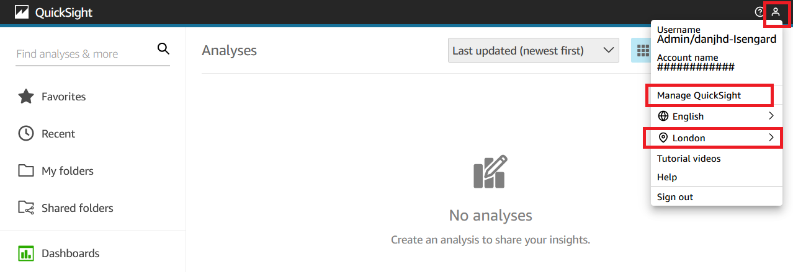

From the left menu select the option _Security & Permissions_ and then _Manage_ QuickSight access to AWS services

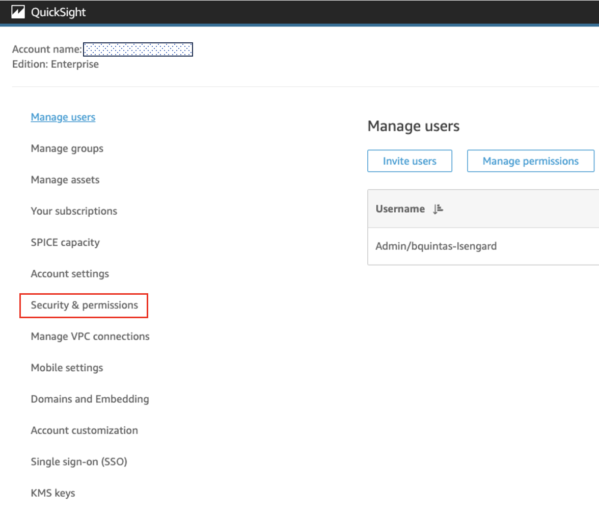

You need to allow Quicksight access to Amazon Athena _and_ that the right Amazon S3 buckets are selected.

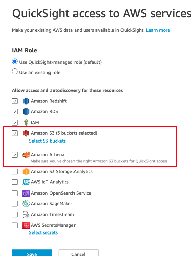

Amazon Quicksight will need access to the Athena Query Output location, typically named _aws-athena-query-results-xxxx_ which should be pre selected and also to the bucket deployed by the solution with a name starting with _latency-checker-bucket-xxxxx_

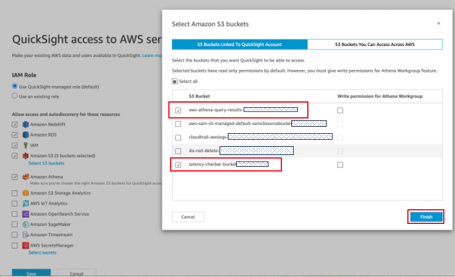

# Instructions on setting up Amazon QuickSight Analysis

We need to assign ownership of the Amazon Quicksight Assets to ensure they are visible and consumable.

Open the Amazon Quicksight console and navigate to the _Manage Quicksight_ page. Make sure the region selected is the one you expect.


From the left menu select the option _Manage Assets_

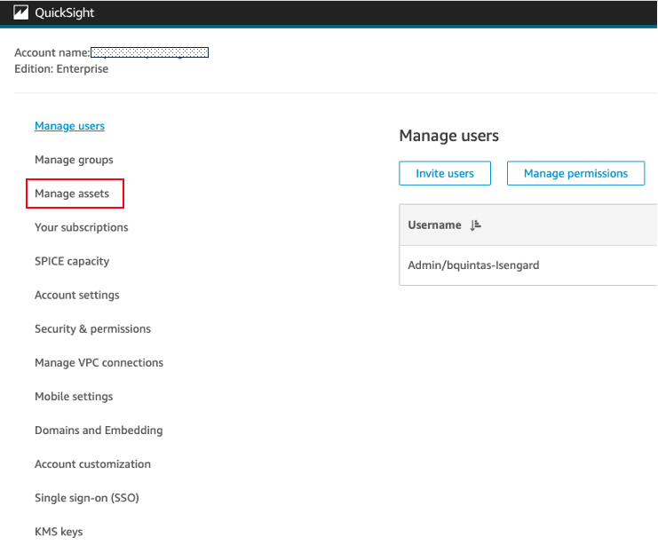

Select the _Data sources_ option.

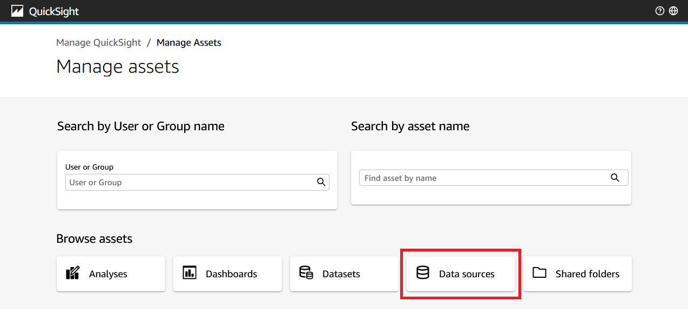

Select the `latencycheckdatabase` and click the _SHARE_ button.

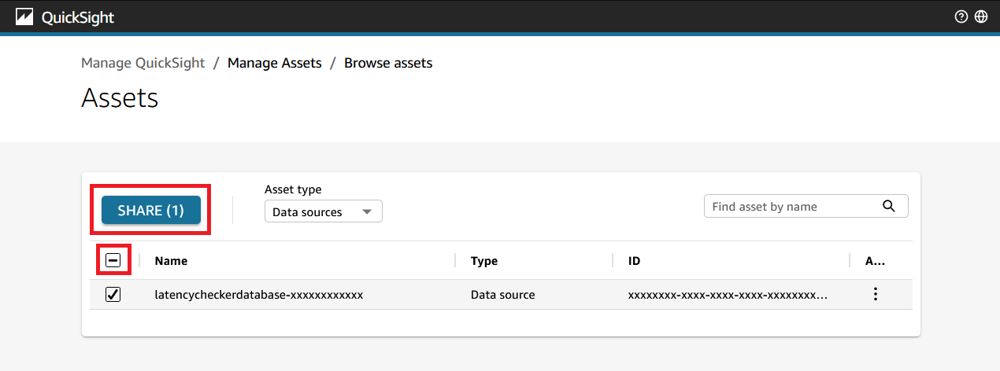

Enter the user or group that you wish from the options and click _SHARE_. It will takes a couple of seconds to assign the ownership. Once complete click _DONE_

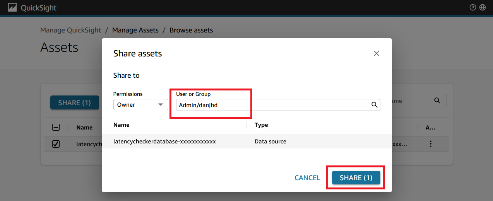

Return to the _Manage assets_ page by clicking at the top

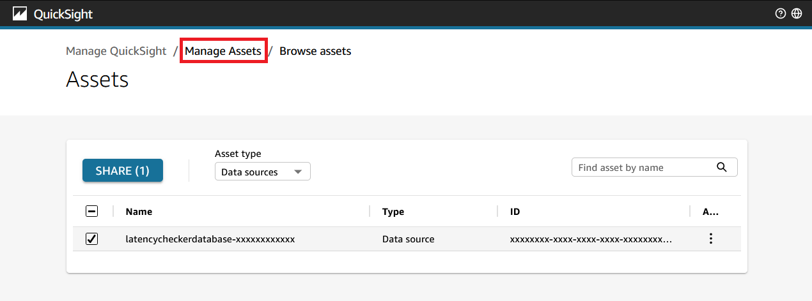

Select the _Analysis_ option.

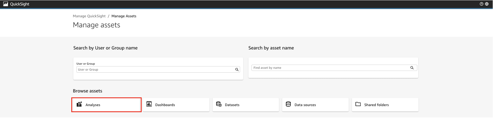

Select the `combined analysis` analysis and click the _SHARE_ button.

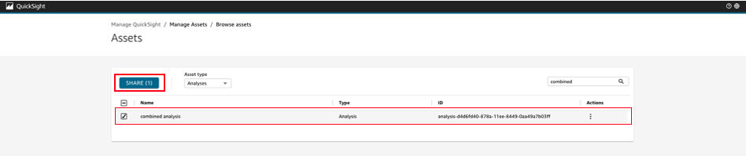

Enter the user or group that you wish from the options and click _SHARE_. It will takes a couple of seconds to assign the ownership. Once complete click _DONE_

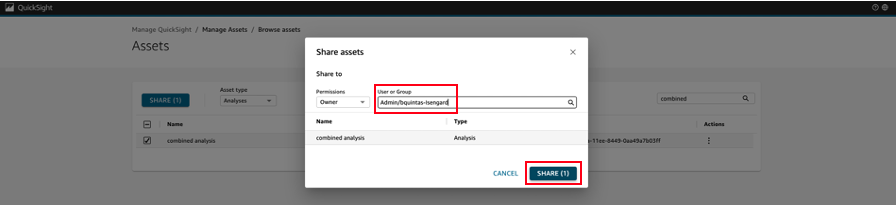

Return to the _Manage assets_ page by clicking at the top


Select the _Datasets_ option.

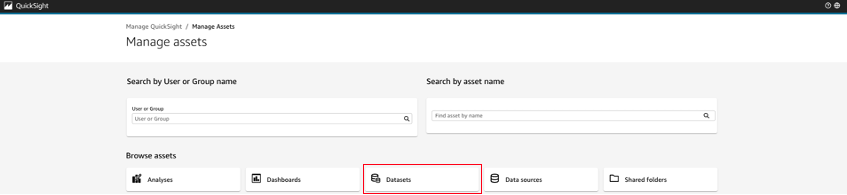

Select the `combined`, `latency` and `lookups` datasets and click the _SHARE_ button.

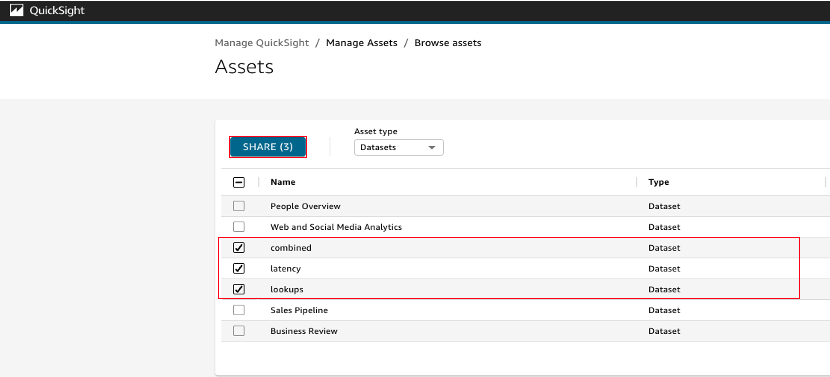

Enter the user or group that you wish from the options and click _SHARE_. It will takes a couple of seconds to assign the ownership. Once complete click _DONE_

Return to the main Amazon Quicksight interface by clicking in the top left corner.

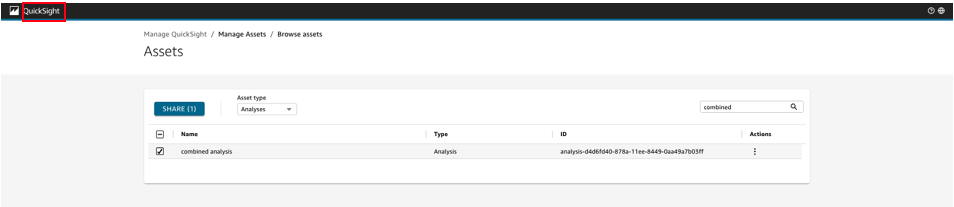

You should now be able to access the Analysis from the Quicksight main menu, it includes 2 starter visuals, the 1st visual is a table with all metrics from host to destination, the second visual is a bar chart displaying average RTT by host and destination. Feel free to add more visuals as your analysis requires.

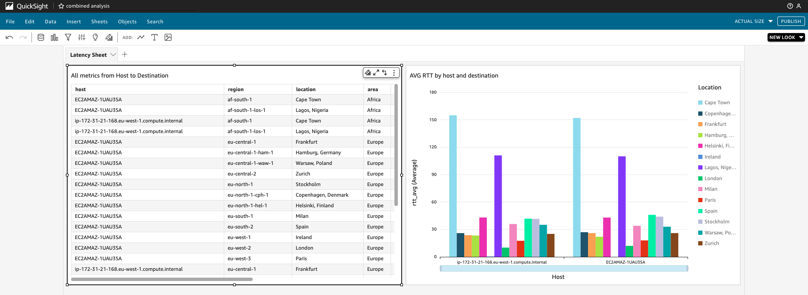
